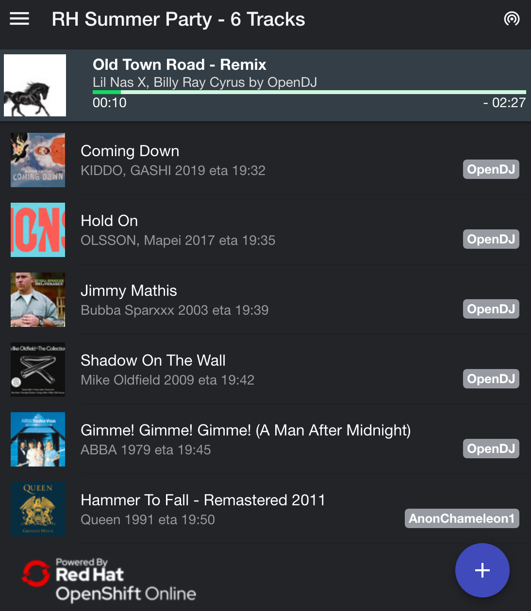
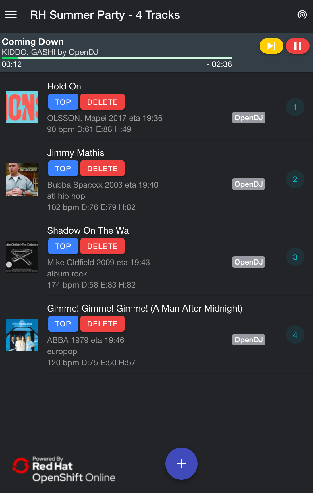

# OpenDJ -Apply Open Source principles to the Dance Floor! 

## Vision
Have you ever been at an event and disliked the music being played?  

The vision of OpenDJ is to solve this problem by applying open source principles to the music playlist of an event.
Participants of an event can contribute to the playlist by  adding tracks. 

*Example view for a User*

Curators can edit the playlist (sorting/grouping by genre, deleting) - they are like the maintainer of an open source project.

*Example view for a Curator*

The music is being played by a streaming provider, e.g. Spotify.

Everybody can add the the playlist, no accounts needed, no access to local devices. OpenDJ is running in the internet and uses streaming provider APIs to execute the playlist on a local device (which might be connected to the PA system of a party location).

## Try it out
A prototype is up and running: demo.opendj.io
You can add tracks by using the blue "Add" button.
In the demo, tracks are skipped every 20s (they are not actually being played). And if the playlist is empty, it is out-filled 

## Learn more about the idea
Read the user stories in the requirements doc [here](docs/10requirements/100requirements.md)

## Contribute
If you like the idea and want to contribute, welcome! We always need people helping with UX Design, Architecture, Design, Coding, Testing, Coding, Dokumentation etc.  Please read the project charter if your are interested! 

To see what is currently happening, please check out the [github project page](hhttps://github.com/tnozicka/openshift-acme). 